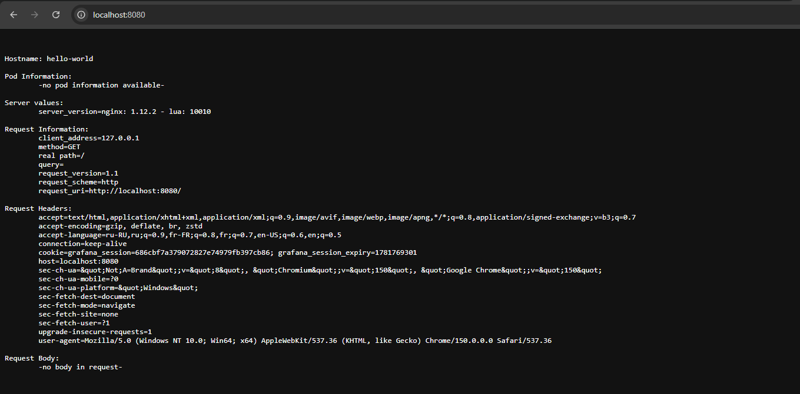
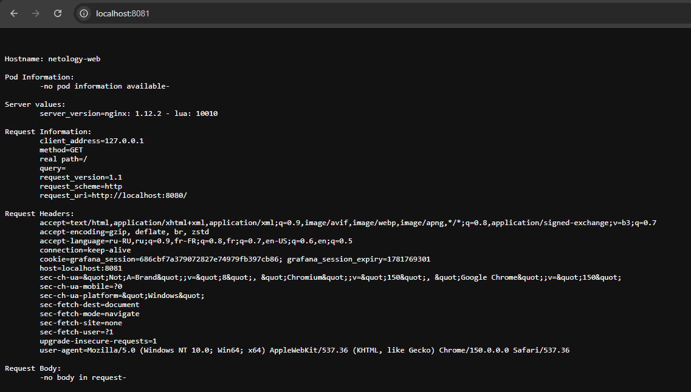
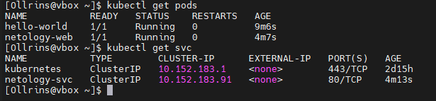

## Домашнее задание к занятию «Базовые объекты K8S»

### Задание 1. Создать Pod с именем hello-world

#### Файл манифеста
- [hello-world.yaml](hello-world.yaml)

#### Результат

  
   

---

### Задание 2. Создать Service и подключить его к Pod

#### Файлы манифестов
- [netology-web.yaml](netology-web.yaml)
- [netology-svc.yaml](netology-svc.yaml)

#### Результат

  
   

  
   

